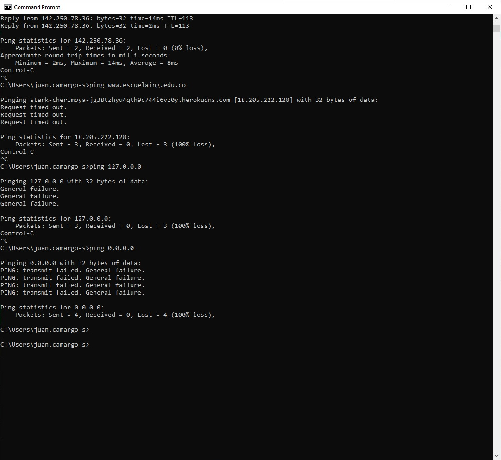

# LABORATORIO 5 - SPRING MVC INTRODUCTION

Integrantes
Juan Sebastian Camargo Sanchez

#### INTRODUCCIÓN A PROYECTOS WEB

### PARTE I. - JUGANDO A SER UN CLIENTE HTTP
*Dado que el servidor de la escuela bloque el uso de telnet y esta porotegido no se pudo hacer la ototalida de este punto*

- ¿Qué codigo de error sale?, revise el significado del mismo en la lista de códigos de estado HTTP.
- ¿Qué otros códigos de error existen?, ¿En qué caso se manejarán?
- Responder en el README.md según lo indicado en la última sección de este laboratorio (ENTREGA).
-¿Cuáles son las diferencias con los diferentes parámetros?

### PARTE II. - HACIENDO UNA APLICACIÓN WEB DINÁMICA USANDO EL PATRÓN MVC
En este ejercicio, va a implementar una aplicación Web muy básica, haciendo uso de spring MVC.

Para esto usaremos la documentación oficial de Spring con que que aprenderemos las funciones básicas de este framework https://spring.io/guides/gs/serving-web-content/

Después de terminar el aprendizaje analice:
- ¿Por qué MVC obtiene ese nombre? (puede apoyarse de https://www.javatpoint.com/spring-mvc-tutorial) 

El modelo contien toda la data para la aplicación. El controllador maneja la logica de la app. La vista presenta la informacion en un formato . Y por ultimo el Front controller que es el encargado de manejar el flujo de la app MVD.

- ¿Cuáles son las ventajas de usar MVC?

La separación de la app en tres componentes distintos facilita su gestion, mantenimiento y escalabilidad. Loq ue la hace útil para el desarrollo de apliaciones complejas y de larga duración.

- ¿Qué diferencia tiene la estructura de directorios de este proyecto comparado con las de proyectos pasados (con solo maven y java EE)?

Este proyecto tiene un directorio extra para guardar los recursos HTML y CSS.

- ¿Qué anotaciones usaste y cuál es la diferencia entre ellas?

Para este nuevo directorio se uso el nombre de "resources" y se guardaran archivos .html o .css.

### PARTE III. - APLICACIÓN MVC PARA CONSUMO DE SERVICIO RESTful
Usando la arquitectura MVC del punto anterior (el proyecto anterior), realice una aplicación simple qué permita navegar gráficamente sobre esta API
https://jsonplaceholder.typicode.com/todos/1, puede guiarse de tutoriales como https://medium.com/@nutanbhogendrasharma/consume-rest-api-in-spring-boot-web-application-354c404850f0

Luego de terminada esta parte responda:
- ¿Qué es RESTful?

REST deriva de “REpresentational State Transfer”. Es una técnica de arquitectura de software, es decir, un conjunto de principios y patrones de comunicación que ayudan a crear una forma de pensar y construir las APIs. El RESTful es la implementacion de la técnica.

- Si utilizo un framework como [Boostrap CSS](https://getbootstrap.com/) para qué el apartado gráfico se vea más profesional, ¿en qué capa se haría su uso?

Se utilizo en la capa View ya que es la representación de la información proveído.

### PARTE IV. - APLICACIÓN MVC JUEGO
¡Llego la hora del reto! Teniendo las bases del uso del framework, cree una nueva ruta, por ejemplo `/guess`, y agrege formulario básico con un campo llamado "número" (guía de como crear formularios HTML https://www.w3schools.com/html/)

Y vamos a implementar la lógica de nuestro juego:
1. Se trata de un juego en línea para adivinar un número, en el que el ganador, si acierta en la primera oportunidad, recibe $100.000. Luego, por cada intento fallido, el premio
se reduce en $10.000, como en los juegos de apuesta, es natural qué quede en saldos negativos.
2. El número a adivinar debe ser generado en cada intento y comparado con el número qué el usuario está insertando, es un número de 1 a 10.
3. Debe existir un botón de reset, qué permita al jugador iniciar de nuevo.
4. La capa de controlador debe procer el número del usuario mediante método `POST`.

Analice las siguientes situaciones:
- ¿Qué pasa si abro el sitio de juegos en dos navegadores difententes?

Ambos jugadores estan compartiendo una misma instancia de Guess, la calse que diseñe para el funcionamiento del juego.

- Si quisiera qué a cada jugador le aparecieran independientemente sus respectivos saldos. ¿Qué habría que hacer?

Almacenar el valor en una cookie o en una variable JavaScript en el lado del cliente. O usar @SessionAttributes de spring.

## ENTREGA
- En un README.md colocar lo siguiente:
- Una sección llamada “INTEGRANTES” y allícolocar el listado de los integrantes del taller (máximo 2).
- Una sección llamada “RESPUESTAS” colocar lasrespuestas a las preguntas:
- Configurar el archivo .gitignore para excluir del repositorio los archivos no relevantes.
- En una carpeta en la raiz del repositorio llamada diagrams y allí realizar un diagrama de clases del proyecto.
